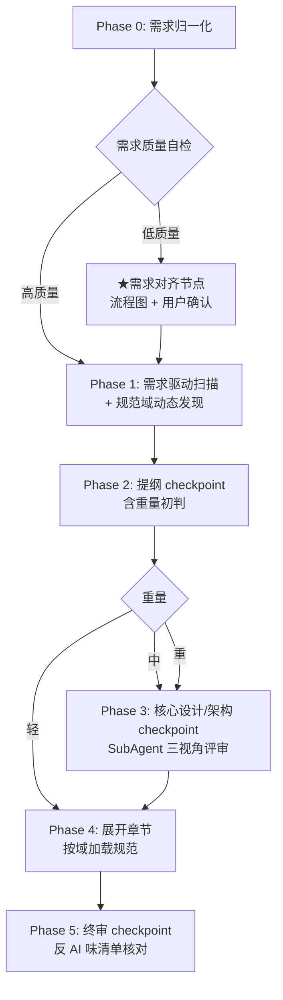

# dev-doc

> 通用技术方案写作 skill，借鉴 [garden-skills](https://github.com/ConardLi/garden-skills) 的 harness 工程思想。

## 解决什么问题

技术方案写作中常见的四个痛点：

1. **项目约束硬编码** —— 团队规范、工时标准写死在 skill 里，换项目就用不了
2. **无 checkpoint** —— 一次性生成整篇，跑偏了只能整篇重来
3. **不主动扫代码库** —— 方案脱离实际代码，凭空设计
4. **方案质量差（AI 味重）** —— 缺 trade-off、分析浮于表面、空话架构

## 核心特性

- **6 Phase 流程**：需求归一化 → 需求驱动扫描 + 规范域发现 → 提纲 checkpoint → 核心设计 checkpoint → 展开章节 → 终审 checkpoint
- **重量分级**（轻/中/重）自适应 checkpoint 数和章节深浅，小改动不被过度设计
- **规范域动态发现**：从代码库扫描推断团队工程约定，用户确认后缓存累积
- **反方案 AI 味清单**：10 条反模式清单，终审逐条对照
- **需求对齐节点**：PRD 质量低时自动生成业务流程图，防止理解偏差

## 快速开始

激活 skill 后，提供一个 feature 名和需求描述即可。例如：

```
帮我写一个 voucher-rule 模块的技术方案
```

skill 会在当前项目下创建 `dev-doc/` 目录承载所有产物：

```
<你的项目>/
└── dev-doc/
    ├── conventions/              # 项目工程规范（跨任务累积，团队共享）
    │   ├── sql.md
    │   ├── interface.md
    │   └── ...
    └── tasks/
        └── voucher-rule/         # 每个需求一个目录，支持多任务并行
            ├── requirement.md    # 需求归一化
            ├── plan.md           # 决策记录
            └── voucher-rule技术方案.md  # 最终产物
```

> **建议**：把 `dev-doc/` 纳入 git，团队共享 conventions。`dev-doc/tasks/<feature>/` 下的 requirement.md / plan.md 是过程产物，但保留可追溯决策。

## 6 Phase 流程概览



## 重量分级

| 重量 | 典型场景 | checkpoint 数 | 核心设计层验收 |
|---|---|---|---|
| **轻** | 单点改动、加字段、改接口签名 | 2（提纲 + 终审）| 跳过 |
| **中** | 新模块、技改、重构、对外接口、多个小优化 | 3 | 验"改动核心设计" |
| **重** | 新项目、跨服务改造 | 3 | 验"全局架构骨架" |

## 配方选择指南

| 配方 | 适用场景 |
|---|---|
| `generic-medium` | 新模块 / 技改 / 重构 / 对外提供接口（9 节通用骨架）|
| `multi-task` | 多个小优化合在一个需求里（按子任务重组章节）|
| `greenfield` | 新项目（重点架构选型，无改动点，加里程碑）|

所有配方共享后端领域决策点（`_backend-domain.md`），覆盖：数据量估算、并发与一致性、事务边界、幂等性、状态设计 + 工时评估参考。

## 设计文档

完整设计说明见 [docs/superpowers/specs/2026-06-19-dev-doc-skill-design.md](./docs/superpowers/specs/2026-06-19-dev-doc-skill-design.md)。

## 致谢

本 skill 的 harness 工程思想（6 层架构）借鉴自 [garden-skills](https://github.com/ConardLi/garden-skills) 的 `beautiful-article` 和 `web-video-presentation`。
