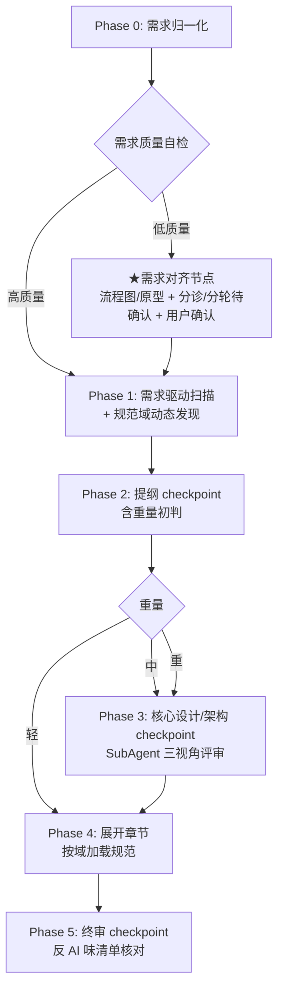

# dev-doc

> 通用技术方案写作 skill，借鉴 [garden-skills](https://github.com/ConardLi/garden-skills) 的 harness 工程思想。

## 解决什么问题

技术方案写作中常见的四个痛点：

1. **项目约束硬编码** —— 团队规范、工时标准写死在 skill 里，换项目就用不了
2. **无 checkpoint** —— 一次性生成整篇，跑偏了只能整篇重来
3. **不主动扫代码库** —— 方案脱离实际代码，凭空设计
4. **方案质量差（AI 味重）** —— 缺 trade-off、分析浮于表面、空话架构

## 核心特性

- **6 Phase 流程**：需求归一化 → 需求驱动扫描 + 规范域发现 → 提纲 checkpoint → 核心设计 checkpoint → 展开章节 → 终审 checkpoint
- **重量分级**（轻/中/重）自适应 checkpoint 数和章节深浅，小改动不被过度设计
- **规范域动态发现 + 规范源复用**：优先探测并复用项目已有约定源（`.claude/rules/` 等）；无源时才从代码扫描推断、用户确认后累积到 `dev-doc/conventions/`
- **反方案 AI 味清单**：10 条反模式清单，终审逐条对照
- **需求对齐节点**：PRD 质量低时自动生成业务流程图；待确认项先做事实/决策分诊（能自己查的不问用户），再标依赖分轮询问；交互类需求可征询用户后生成低保真原型辅助对齐（需求自带原型不可信——图文矛盾/无法读取——时同样触发）
- **评审版衍生**：方案确认后生成面向技术评审的精简版，结构按配方分形——单一需求横切 9 节，multi-task 按子任务纵切（改动 → 变更接口 → 核心逻辑）；主方案变更自动整篇重生成，任务级可关闭（"不要评审版"即关）

## 快速开始

激活 skill 后，提供一个 feature 名和需求描述即可。例如：

```
帮我写一个 voucher-rule 模块的技术方案
```

skill 会在当前项目下创建 `dev-doc/` 目录承载产物：

```
<你的项目>/
└── dev-doc/
    ├── conventions/              # 规范源之一：项目无现成约定源时产出；否则复用项目已有源
    │   ├── sql.md
    │   └── ...
    └── tasks/
        └── voucher-rule/         # 每个需求一个目录，支持多任务并行
            ├── requirement.md    # 需求归一化
            ├── plan.md           # 决策记录（含规范源声明）
            ├── prototype.html    # 低保真原型（仅交互类需求对齐时产出，一次性工具非交付物）
            ├── voucher-rule技术方案.md  # 最终产物（面向编码 AI）
            └── voucher-rule技术方案-评审版.md  # 评审版（确认后生成，变更自动重生成，单向衍生不可手改）
```

> **conventions 是否产出看项目**：Phase 1 先探测项目是否已有约定源（`.claude/rules/` 等）。**有 → 复用，不另建 `dev-doc/conventions/`**（只把扫描到的新约定作增量补进去，确认后 skill 会建议你合并回规范源，合并后删增量，不越积越多）；**无 → 从零累积到 `dev-doc/conventions/`**。
>
> **建议**：把 `dev-doc/` 纳入 git。复用模式下约定源（如 `.claude/rules/`）天然团队共享；从零模式下 `dev-doc/conventions/` 越用越全。`dev-doc/tasks/<feature>/` 下的 requirement.md / plan.md 是过程产物，但保留可追溯决策。

## 兼容性

面向支持 Agent Skills 的 CLI agent（Claude Code / Codex CLI / Gemini CLI / OpenCode）。运行环境要求（目录读写、grep/glob 扫描、SubAgent 派发）声明在 `SKILL.md` frontmatter 的 `compatibility` 字段——这是 Agent Skills 规范的标准位置，遵循规范的运行时可直接读取。

## 测试

本 skill 有一套基于对照实验的回归测试方法（4 条路径：轻方案含关闭路径 / 低质量需求对齐 / multi-task 合并 / 评审版生成与同步，共 32 条断言，带 skill vs 裸跑对照）。**测试资产不入仓库**：用例和 fixture 在本地 `evals/`（已 gitignore），运行产物在 `../dev-doc-workspace/`。

2026-08 iteration-1 基线：带 skill 断言通过率 100%（21/21），裸跑 47.6%（10/21）。增益集中在过程纪律（工时评估、决策可追溯、需求归一化），耗时约为裸跑的 2-5 倍。

## 6 Phase 流程概览



> Phase 5 交付确认后可选生成「评审版」技术方案（面向评审的 8 节精简版，主方案变更自动整篇重生成，详见 SKILL.md 与 references/review-doc.md）。

## 重量分级

| 重量 | 典型场景 | checkpoint 数 | 核心设计层验收 |
|---|---|---|---|
| **轻** | 单点改动、加字段、改接口签名 | 2（提纲 + 终审）| 跳过 |
| **中** | 新模块、技改、重构、对外接口、多个小优化 | 3 | 验"改动核心设计" |
| **重** | 新项目、跨服务改造 | 3 | 验"全局架构骨架" |

## 配方选择指南

| 配方 | 适用场景 |
|---|---|
| `generic-medium` | 新模块 / 技改 / 重构 / 对外提供接口（9 节通用骨架）；其他类型的兜底（轻方案按"轻"深浅薄写）|
| `multi-task` | 多个小优化合在一个需求里（按子任务重组章节，**最低判"中"**，必过核心设计 checkpoint）|
| `greenfield` | 新项目（重点架构选型，无改动点，加里程碑）|

所有配方共享后端领域决策点（`_backend-domain.md`），覆盖：数据量估算、并发与一致性、事务边界、幂等性、状态设计 + 工时评估参考。

## 设计理念：6 层 Harness

本 skill 借鉴 [garden-skills](https://github.com/ConardLi/garden-skills) 的 harness 工程思想：**把 skill 当成一个 harness，分 6 层对抗 LLM 写方案时的三个失败模式**——上下文遗忘、决策漂移、静默选择。

### 6 层落地映射

| Harness 层 | 管什么 | dev-doc 的落地 | 对应 Phase |
|---|---|---|---|
| ① 上下文管理 | 模型每个时刻看到什么 | `requirement.md` + 需求驱动两阶段扫描 + 规范源声明制 + 按章按域加载规范 | 0 / 1.1-1.2 / 1.3 / 4.1 |
| ② 工具系统 | Agent 能动手做什么 | grep / glob / read + WebSearch + mermaid；不跑 PoC | 散见各 Phase |
| ③ 执行编排 | 下一步做什么、顺序 | 重量分级（轻/中/重）+ 自适应 checkpoint（轻=2，中/重=3）+ Phase 3 当"风险探针" | 2.1 / 2.5 / 3 |
| ④ 状态记忆 | 决策如何跨阶段保持 | 极简 `plan.md`（"关键决策"区块，Phase 4 每章回看防漂移）+ 按任务目录隔离 | 前置 / 2.3 / 3.4 |
| ⑤ 评估观测 | 怎么知道好不好 | 冷节点开 SubAgent 三视角（可行性 / 风险 / 成本）；输出**问题清单**而非"通过/不通过"；不落盘；无 SubAgent 派发能力的环境（如嵌套 agent）降级为主 agent 逐视角自评，偏差记入 plan.md | 3.3 / 5.1 |
| ⑥ 约束恢复 | 防平庸、跑偏怎么修 | 反 AI 味 10 条 + 静默假设清零 + 最小切片修复 + 修前声明"爆炸半径" | 5.2 / 全局约束 |

### 三个失败模式由哪几层覆盖

- **上下文遗忘** → ① 上下文管理（只读边界内、按需加载）+ ④ 状态记忆（决策外置到 `plan.md`，反复回看）
- **决策漂移** → ③ 执行编排（checkpoint 硬停 + Phase 3 探针提前暴露漏洞）+ ⑥ 约束恢复（最小切片，一处错只改一处）
- **静默选择** → ⑤ 评估观测（问题清单强制暴露）+ ⑥ 约束恢复（反 AI 味 + 终审静默假设清零 + checkpoint 逐项确认禁打包）

### 借鉴成熟度

| 层 | 从 garden 迁移的程度 |
|---|---|
| 状态记忆 / 约束恢复 | 几乎直接照搬 |
| 执行编排 / 评估观测 | 框架照搬，内容替换（验收维度换成逻辑，新增重量分级） |
| 上下文管理 | 框架照搬，核心机制重发明（代码库处理是 garden 没现成范式的） |
| 工具系统 | 基本从零（完全不同的工具栈） |

## 致谢

本 skill 的 harness 工程思想（6 层架构）借鉴自 [garden-skills](https://github.com/ConardLi/garden-skills) 的 `beautiful-article` 和 `web-video-presentation`。
