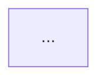

# dev-doc Skill 设计文档

> 创建时间：2026-06-19
> 状态：待评审

## 背景与目标

### 要解决的问题

作者在 voucher-engine 项目有一个初版 skill（`.claude/commands/tech-doc.md`），用于生成技术方案文档。初版存在四个核心痛点：

1. **项目约束硬编码** —— Druid 解析器规则、工时评估标准、生产数据量驱动等约束写死在 skill 里，换个项目就用不了
2. **无 checkpoint** —— 一次性生成整篇，跑偏了只能整篇重来
3. **不主动扫代码库** —— 现有的 `KnowledgeIndex.md` 是被动引用，不是按需求主动捞信息，方案可能脱离实际代码
4. **方案质量差（AI 味重）** —— 生成的方案缺 trade-off、分析浮于表面、空话架构

### 设计目标

做一个**通用**的技术方案写作 skill（`dev-doc`），借鉴 garden-skills 的 `beautiful-article` 和 `web-video-presentation` 的 harness 工程思想，解决上述痛点。

### 借鉴来源

[garden-skills](https://github.com/ConardLi/garden-skills) 的核心工程思想是把 skill 当作一个「harness」来设计，分六层对抗 LLM 的三个失败模式（上下文遗忘、决策漂移、静默选择）：

| Harness 层 | 解决的问题 |
|---|---|
| ① 上下文管理 | 模型在每个时刻看到什么 |
| ② 工具系统 | Agent 能动手做什么 |
| ③ 执行编排 | 下一步做什么、顺序怎么走 |
| ④ 状态与记忆 | 决策如何跨阶段保持 |
| ⑤ 评估与观测 | 怎么知道好不好 |
| ⑥ 约束与恢复 | 防平庸、跑偏怎么修 |

本设计把这六层全部落地到技术方案场景，其中上下文管理层（代码库处理）和工具系统层是 garden 没有现成范式、需要重新设计的部分。

---

## 关键设计决策（已确认）

| 决策点 | 选择 | 理由 |
|---|---|---|
| 产物形态 | Markdown + mermaid 图表 + 末尾"实现速查"索引节 | git 友好；不加双层结构，人和编码 AI 读同一份 |
| 方案范围 | 通用骨架 + 可扩展配方目录，MVP 做 4 个配方 | 覆盖后端 Java 的常见需求场景 |
| 输入来源 | 需求 + 现有代码库，需求驱动深度分析 | 避免无差别扫描发散 |
| 协作强度 | 重 checkpoint，3 个（提纲/核心设计/终审）| 防方案跑偏 |
| 重量分级 | 轻/中/重三档，自适应 checkpoint 数和章节深浅 | 小改动不被过度设计，大方案不被低估 |
| 规范域来源 | 动态发现（不预设清单）+ 用户确认 + 缓存累积 | 不同项目规范域不同，硬编码必漏或冗余 |
| 状态记忆 | 极简：requirement.md + plan.md（按任务隔离）| 吸取 garden「少而准优于多而全」的教训 |
| 评审产物 | 不落盘，对话里给用户 | 符合极简状态记忆原则 |
| PoC 能力 | 不跑 | 控制工具系统复杂度 |

---

## 第 1 节：整体架构与文件结构

### 1.1 Skill 本体结构

```
dev-doc/
├── SKILL.md                          ← Agent 入口：6 层机制 + 重量分级流程
├── references/
│   ├── recipes/
│   │   ├── _backend-domain.md        ← 后端领域决策点（共享层，被三个配方引用）
│   │   ├── generic-medium.md         ← 通用骨架（新模块/技改/重构/对外接口）
│   │   ├── multi-task.md             ← 多任务场景（章节按子任务重组）
│   │   └── greenfield.md             ← 新项目场景（重点架构选型）
│   ├── anti-ai-signs.md              ← 反方案 AI 味清单（10 条）
│   ├── mermaid-checklist.md          ← 图表规范 + 自检清单
│   └── convention-extraction.md      ← 规范域发现指引（独立成文，不进 SKILL）
└──（无 scripts —— 不跑 PoC，工具栈是 Agent 原生能力）
```

**命名约定**：
- 下划线前缀（`_backend-domain.md`）表示"被引用的共享层，不是独立配方"
- 配方按「章节结构差异」分，后端领域知识作为共享层叠加，避免重复

### 1.2 用户项目运行时产物

```
<用户项目>/
└── dev-doc/                          ← 普通目录，进 git，团队共享
    ├── conventions/                  ← 项目级：跨任务共享、长期累积
    │   ├── sql.md
    │   ├── interface.md
    │   └── ...
    │
    └── tasks/                        ← 需求级：按需求隔离，支持多任务并行
        ├── voucher-rule/             ← 每个需求一个目录
        │   ├── requirement.md
        │   ├── plan.md
        │   └── voucher-rule技术方案.md  ← 最终产物（9 节 + 实现速查）
        │
        └── coupon-refactor/
            ├── requirement.md
            ├── plan.md
            └── coupon-refactor技术方案.md
```

**两层语义**：

| 层级 | 内容 | 生命周期 | git |
|---|---|---|---|
| `dev-doc/conventions/` | 项目工程规范 | 长期累积，跨任务复用 | 进 git，团队共享 |
| `dev-doc/tasks/<feature>/` | 单个需求的需求+决策+方案 | 每个需求独立，不覆盖 | 进 git，可追溯 |

**设计要点**：
- 支持多需求并行（`tasks/voucher-rule/` 和 `tasks/coupon-refactor/` 互不干扰）
- 规范累积有去处（每次扫描发现的规范往 `conventions/` 沉淀）
- 任务可追溯（每个方案的 requirement/plan/文档都保留）

### 1.3 完整流程（6 Phase）

```
前置：确定任务
  ├─ 用户提供 feature 名（如 "voucher-rule"）
  ├─ 检查 dev-doc/tasks/<feature>/ 是否存在
  │   ├─ 不存在 → 创建，开始新任务
  │   └─ 存在 → 询问"继续这个任务还是新建"
  └─ 后续所有产物都落在该任务目录下

Phase 0: 需求归一化 → requirement.md
         ├─ 写需求复述（背景/目标/范围）
         ├─ 需求质量自检（4 项）
         ├─ 低质量 → ★需求对齐节点（补 mermaid 流程图 + 列待确认项 → 用户确认）
         └─ 高质量 → 直接进 Phase 1

Phase 1: 需求驱动扫描 + 规范域动态发现
         ├─ 阶段 A：边界确定（轻量定位，产出影响范围）
         ├─ 阶段 B：深度分析（只读边界内的代码）
         └─ 规范域发现 → 推断 → 用户确认 → 缓存到 conventions/

Phase 2: 提纲 checkpoint
         ├─ 展示：影响范围 + 重量初判 + 章节规划 + 关键设计方向
         ├─ 用户逐项确认（禁止打包 yes/no）
         └─ 重量分支：轻→跳过 Phase 3 / 中→Phase 3 验改动核心设计 / 重→Phase 3 验全局架构

Phase 3: 核心设计/架构 checkpoint（轻方案跳过）
         ├─ 中方案：验收改动的核心接口/数据模型/状态机
         ├─ 重方案：验收全局架构图 + 模块职责 + 核心选型
         ├─ SubAgent 三视角评审（可行性/风险/成本）→ 对话给，不落盘
         └─ 决策写入 plan.md 的"关键决策"区块

Phase 4: 展开章节
         ├─ 每写一章，查 plan.md 章节规划表 → 加载对应 conventions/
         └─ 图表章节加载 mermaid-checklist.md

Phase 5: 终审 checkpoint
         ├─ SubAgent 多视角终审（逻辑自洽/风险完整/可实现）
         ├─ 对照 anti-ai-signs.md 逐条核对
         └─ 确认 requirement.md 待确认项闭环
```

### 1.4 产物文档结构

沿用初版 9 节 + 末尾追加实现速查：

```
1. 需求背景
2. 需求说明
3. 技术方案（整体架构/数据模型/接口契约/状态机/关键流程）
4. 改动点
5. 数据库变更
6. 测试方案
7. 上线方案
8. 风险评估
9. 工时评估
10. 实现速查（索引 DDL/接口/状态机/改动清单/工时所在章节，给编码 AI 快速定位）
```

**不加双层结构**：人和编码 AI 读同一份内容。实现速查节是零成本的指针索引，不产生漂移。

### 1.5 和初版的关系

| 初版内容 | 新设计位置 |
|---|---|
| 9 节文档结构 | `recipes/generic-medium.md` + `_backend-domain.md` |
| Druid 规则 | 动态发现的示范样例（`convention-extraction.md`） |
| 工时评估标准 | `recipes/_backend-domain.md`（领域知识配方） |
| 数据量驱动设计 | `anti-ai-signs.md` 第 4 条 |
| Mermaid 自检 | `mermaid-checklist.md` |
| 测试策略引用 rules/test.md | 按域加载的现成案例，直接支持 |
| "设计原则"段落 | SKILL.md 的约束部分 |

---

## 第 2 节：上下文管理层落地细节

### 2.1 requirement.md 的精确结构

```markdown
# 需求：<feature-name>

## 需求来源
- 来源：PRD / 口述 / Issue / 无（需补充）
- 原始链接/路径：（如有）

## 需求复述
### 背景
（为什么要做，解决什么问题）
### 目标
（这个方案要达成什么）
### 范围
- 在范围内：...
- 不在范围内：...

## 业务流程（仅低质量需求时生成）


## 待确认项（仅低质量需求时生成）
- [ ] Q1: ...（影响：...）

## 数据量线索（Phase 1 扫描后补充）
- 相关表的估算量级、单次查询命中量
```

### 2.2 需求质量自检规则

| 自检项 | 触发"低质量" |
|---|---|
| 业务目标能否一句话说清 | 不能 → 低 |
| 范围边界是否明确 | 模糊 → 低 |
| 是否有关键业务流程需要厘清 | 是 → 低 |
| 是否存在明显缺失的关键信息 | 是 → 低 |

四项全过 → 高质量，跳过需求对齐节点；任一不过 → 低质量，触发需求对齐节点（生成业务流程图 + 待确认项，给用户确认）。

### 2.3 需求驱动扫描的两阶段

**阶段 A：边界确定（轻量，先做）**

从 requirement.md 提取"要碰什么"（模块名、接口、表、技术栈关键词），用 grep/glob 在代码库里**只定位不深读**，产出"影响范围清单"写入 plan.md：

```markdown
## 影响范围（plan.md）
- 模块：voucher-service, coupon-module
- 关键文件：VoucherService.java, CouponRepository.java
- 涉及表：t_voucher, t_coupon_rule
- 上下游依赖：OrderService（调用方）, NotificationJob（被调用方）
```

**阶段 B：深度分析（只对边界内）**

只深读阶段 A 圈定的文件/模块，理解现状。产出写入 plan.md 的"现状分析要点"。

**核心纪律**（写进 SKILL.md）：
- 阶段 A 必须先于阶段 B
- 阶段 B **严禁越界** —— 不能因为"顺手看到个相关文件"就扩大范围
- 范围确认**不加独立 checkpoint**，搭车 Phase 2 提纲 checkpoint（影响范围是提纲的一部分，用户在提纲 checkpoint 可推翻）

### 2.4 规范域动态发现机制

```
阶段 B 深度分析时
  ↓
对每个被读的代码区域，提取"这里体现了什么工程约定"
  ↓
聚类成规范域（不预设清单，但给"常见规范域提示"作为起点）
  ↓
写入 dev-doc/conventions/<domain>.md（带时间戳 + 来源文件 + 置信度）
  ↓
集中展示给用户确认/修正
```

**规范域文件的精确结构**：

```markdown
# 规范域：SQL / 数据模型

## 提取时间
2026-06-19

## 来源文件
- src/main/resources/mapper/VoucherMapper.xml
- src/main/java/.../VoucherEntity.java

## 推断的约定
- 表名前缀：t_
- 主键：bigint(20) UNSIGNED NOT NULL AUTO_INCREMENT，独立声明 PRIMARY KEY
- int 类型带长度：int(11)
- 索引名 ≤ 30 字符

## 置信度
可信 / 待确认

## 用户确认
[ ] 已确认  [ ] 已修正：（用户填）
```

**关键设计点**：
1. **置信度两档**：多文件一致 → `可信`（直接采信）；单文件/少量推测 → `待确认`（用户重点看）
2. **域不预设，但给提示清单**：SKILL.md 写"常见规范域提示"（命名/分层/接口/SQL/日志/异常/配置），明确这只是提示
3. **按章节关联**：plan.md 的章节规划表必须标注"这个章节加载哪些规范域"

### 2.5 上下文加载总表

| 阶段 | 加载什么 | 来源 |
|---|---|---|
| Phase 0 | 需求（原始输入） | 用户给 |
| Phase 1 | 影响范围 + 现状 | 代码库扫描 |
| Phase 1 | 规范域 | 扫描推断 + 用户确认 |
| Phase 2 | 配方（generic-medium/multi-task/greenfield） | references/recipes/ |
| Phase 2 | 后端领域决策点 | references/recipes/_backend-domain.md |
| Phase 3 | 反 AI 味清单 | references/anti-ai-signs.md |
| Phase 4（每章）| 该章节关联的规范域 | dev-doc/conventions/ |
| Phase 4（图表章）| mermaid 规范 | references/mermaid-checklist.md |
| Phase 5 | 反 AI 味清单 + 终审视角 | references/anti-ai-signs.md |

### 2.6 plan.md 的精确结构

```markdown
# 决策记录：<feature-name>

## 任务元信息
- 创建时间：2026-06-19
- 状态：进行中 / 已完成
- 配方：generic-medium / multi-task / greenfield
- 重量：轻 / 中 / 重

## 影响范围（Phase 1 阶段 A 产出）
- 模块：...
- 关键文件：...
- 涉及表：...
- 上下游依赖：...

## 现状分析要点（Phase 1 阶段 B 产出）
- 现有实现方式：...
- 痛点：...

## 重量判定依据
- 触碰模块数：N
- 是否新建基础设施：是/否
- 影响半径：...
- 判定：中（依据：...）

## 章节规划 + 规范域关联
| 章节 | 深浅（重量决定）| 关联规范域 |
| 数据模型 | 深写 | sql |
| 接口契约 | 深写 | interface, error-code |
| 改动清单 | 深写 | project-structure |
| 风险评估 | 深写 | - |

## 关键决策（Phase 3 产出，跨阶段复用）
- 决策1：选用 X 而非 Y，因为 ...
- 决策2：...
```

**设计要点**：
- "关键决策"区块是核心 —— Phase 3 定下的架构决策，Phase 4 写章节时必须回看，保证不漂移
- "章节规划"表格驱动按域加载
- 重量决定"深写/正常/薄写/跳过"
- 无 review 文件（符合"不落盘评审"）

---

## 第 3 节：执行编排 + 重量分级落地

### 3.1 重量判定标准

重量 = 需求 × 代码库现状。判定发生在 Phase 1 扫描后（不是看需求文字判，是"需求 + 扫描结果"判）。

| 维度 | 轻 | 中 | 重 |
|---|---|---|---|
| 触碰模块数 | 1 | 2-3 | ≥4 或跨服务 |
| 是否新建基础设施 | 否 | 否 | 是 |
| 是否涉及数据模型变更 | 否/加字段 | 加表/改结构 | 跨库/分库分表 |
| 是否涉及接口契约变更 | 改现有 | 新增接口 | 改现有且影响调用方 |
| 影响半径 | 单点 | 模块内 | 跨模块/跨团队 |

**判定规则**：任一维度达到"重" → 整体重；否则任一"中" → 中；全"轻" → 轻。

Agent 判定后把每个维度的命中情况写进 plan.md 的"重量判定依据"，用户在提纲 checkpoint 能看到理由、可推翻。

**典型需求类型映射**：
- 轻：模块需求调整里的单点改动
- 中：新模块、对外提供接口、技改、重构、多个小优化
- 重：新项目、跨服务改造

### 3.2 三种重量的流程差异

```
Phase 0  需求归一化         ← 三者都做
Phase 1  扫描 + 规范发现     ← 三者都做
Phase 2  提纲 checkpoint     ← 三者都做（含重量确认）
Phase 3  核心设计 checkpoint ← 轻:跳过   中:验"改动核心设计"   重:验"全局架构骨架"
Phase 4  展开章节            ← 三者都做（重量决定章节深浅）
Phase 5  终审 checkpoint     ← 三者都做
```

- **轻方案**：checkpoint 数 = 2（提纲 + 终审），提纲定死后直接展开
- **中方案**：checkpoint 数 = 3，Phase 3 验收"这次改动"的核心设计
- **重方案**：checkpoint 数 = 3，Phase 3 验收"全局"架构

### 3.3 三个 checkpoint 各验什么

**Checkpoint 1：提纲（Phase 2）**

用 AskUserQuestion，每项独立确认，**禁止打包 yes/no**：

| 确认项 | 内容 |
|---|---|
| 影响范围 | 碰哪些模块/表/接口（搭车确认） |
| 重量判定 | 轻/中/重 + 依据 + 后续流程 |
| 章节规划 | 哪些章节深写/薄写 |
| 关键设计方向 | 1-2 句话点明方案主线（不展开细节） |

**Checkpoint 2：核心设计/架构（Phase 3，轻方案跳过）**

| 确认项 | 中方案 | 重方案 |
|---|---|---|
| 核心设计 | 改动的核心接口/数据模型/状态机 + 关键决策 | 全局架构图 + 模块职责 + 核心选型理由 |
| SubAgent 评审 | 可行性/风险/成本三视角（对话给，不落盘） | 同左 |

用户确认后，决策写入 plan.md 的"关键决策"区块，Phase 4 所有章节必须回看。

**Checkpoint 3：终审（Phase 5）**

| 确认项 | 内容 |
|---|---|
| SubAgent 多视角终审 | 逻辑自洽性 / 风险完整性 / 可实现性 |
| 反 AI 味清单核对 | 逐条对照 anti-ai-signs.md |
| 待确认项闭环 | requirement.md 里的待确认项是否都已解决 |

### 3.4 重量分级如何影响章节深浅

| 章节 | 轻 | 中 | 重 |
|---|---|---|---|
| 需求背景 | 薄写 | 正常 | 正常 |
| 技术方案·整体架构 | 跳过 | 薄写 | 深写 |
| 技术方案·数据模型 | 深写（核心） | 深写 | 深写 |
| 技术方案·接口契约 | 深写（核心） | 深写 | 深写 |
| 改动点 | 深写 | 深写 | 深写 |
| 数据库变更 | 按需 | 正常 | 深写 |
| 测试方案 | 薄写 | 正常 | 深写 |
| 上线方案 | 薄写 | 正常 | 深写 |
| 风险评估 | 薄写 | 正常 | 深写 |
| 工时评估 | 深写 | 深写 | 深写 |

**深浅含义**（写进 SKILL.md）：
- 深写 = 完整论证 + 细节 + trade-off
- 正常 = 标准内容，点到为止的论证
- 薄写 = 1-2 段，不展开论证
- 跳过 = 不写该章节

---

## 第 4 节：评估观测 + 约束恢复落地

### 4.1 评估观测 —— SubAgent 评审协议

| 节点 | 开 SubAgent？ | 视角 | 输出 |
|---|---|---|---|
| 提纲判定（Phase 2） | ❌ 主 Agent 内联查（热上下文） | - | 直接进 checkpoint |
| 核心设计（Phase 3） | ✅ 中/重方案开 | 可行性 / 风险 / 成本 三视角 | 对话给，**不写文件** |
| 终审（Phase 5） | ✅ 开 | 逻辑自洽 / 风险完整 / 可实现 | 对话给，**不写文件** |

**三视角的具体含义**：

| 视角 | 评什么 | 典型问题 |
|---|---|---|
| 可行性 | 技术上能不能做 | 选型的依赖有没有？团队技术栈支持吗？有没有未验证的假设？ |
| 风险 | 会出什么事 | 数据一致性风险？并发风险？回滚不了的场景？ |
| 成本 | 值不值得 | 工时合理吗？有没有过度设计？维护成本？ |

**关键约束**：SubAgent 的评审结果**必须以"问题清单"形式给出**，不是"通过/不通过"。评审的价值是暴露问题，不是盖章。

### 4.2 反方案 AI 味清单（写进 references/anti-ai-signs.md）

**通用部分（所有方案适用）**：

1. **空话架构** —— "采用微服务架构""使用 Redis 缓存"无细节。正确：写清为什么用、容量估算、关键配置、失效策略
2. **无 trade-off** —— 只写选了什么，不写为什么不选别的。正确：每个关键决策带"考虑过 X，因为 Y 没选"
3. **放之四海皆准** —— 方案套在任何项目都对。正确：必须结合本项目的数据量/现状/约束
4. **无数据量** —— 只看表行数设计。正确：估算单次查询命中量，影响分页/批量/异步决策
5. **无风险/回滚** —— 只写怎么做，不写出事怎么办。正确：风险评估 + 回滚方案是必备章节
6. **过度设计** —— 小改动套大架构。正确：重量分级，轻方案不写架构章节

**后端服务特有**：

7. **DDL 无估算** —— 不看数据量就加索引。正确：索引设计结合表数据量和查询模式
8. **状态机不完整** —— 只画图不写触发条件和副作用。正确：每个流转写触发条件 + 副作用 + 守卫条件
9. **接口契约模糊** —— "返回成功/失败"。正确：精确的错误码、幂等性、版本策略
10. **测试方案空洞** —— "编写单元测试保证质量"。正确：具体测试类、覆盖场景、数据准备方式

**层次说明**：前 6 条所有方案通用，后 4 条后端服务特有（和 `_backend-domain.md` 呼应）。未来扩展前端/数据方案时，可叠加对应的反 AI 味条目。

### 4.3 最小切片修复

**触发**：任何一个 checkpoint 用户提出修改，或终审 SubAgent 暴露问题。

**原则**：只改出问题的部分，不重写整篇/整章。

| 修改类型 | 修复范围 |
|---|---|
| 提纲级（范围/重量/章节结构错） | 只改 plan.md，重做受影响章节 |
| 核心设计级（架构/选型错） | 改 plan.md 的"关键决策"，重做依赖该决策的章节 |
| 章节级（某章内容错） | 只改该章，不动其他 |
| 细节级（某接口/字段错） | 只改该处 |

**关键纪律**（写进 SKILL.md）：Agent 修复时**必须先声明影响范围** —— "这个修改会影响 X、Y 章节，Z 章节不动"，让用户知道修复的爆炸半径。禁止静默大面积重写。

### 4.4 工具系统最终形态

工具栈：代码检索（grep/glob/read）+ WebSearch（选型依据验证）+ mermaid 图表生成。**不跑 PoC**。

**图表生成规范**落 到 `references/mermaid-checklist.md`：
- 架构图用 `flowchart` / `C4Context`
- 时序图用 `sequenceDiagram`
- 状态机用 `stateDiagram-v2`
- 自检清单：节点引号、subgraph 命名、箭头标签、`~` 符号等（继承自初版第 98 行规则）

写到图表章节时加载这个 reference。

---

## 六层 harness 落地总结

| Harness 层 | 本设计的核心机制 |
|---|---|
| ① 上下文管理 | requirement.md + 需求驱动两阶段扫描 + 规范域动态发现 + 按章节按域加载 |
| ② 工具系统 | 代码检索 + WebSearch + mermaid，不跑 PoC |
| ③ 执行编排 | 重量分级（轻/中/重）+ 自适应 checkpoint（轻=2，中/重=3）+ 核心设计当风险探针 |
| ④ 状态记忆 | 极简：requirement.md + plan.md，按任务隔离；规范缓存项目级累积 |
| ⑤ 评估观测 | 热上下文就地查 / 冷关键节点开 SubAgent（可行性·风险·成本）/ 不落盘 / 输出问题清单 |
| ⑥ 约束恢复 | 内置反 AI 味清单（10 条）+ 最小切片修复 + 声明影响范围 |

**迁移成熟度**：

| 层 | 迁移到技术方案的成熟度 |
|---|---|
| 状态记忆 / 约束与恢复 | 几乎直接照搬 garden |
| 执行编排 / 评估观测 | 框架照搬，内容替换（验收维度从视觉换成逻辑，新增重量分级） |
| 上下文管理 | 框架照搬，核心机制重发明（代码库处理） |
| 工具系统 | 基本从零（完全不同的工具栈） |

---

## 范围说明（MVP 边界）

**MVP 包含**：
- 6 Phase 完整流程
- 重量分级机制（轻/中/重）
- 4 个配方（generic-medium / multi-task / greenfield + _backend-domain 共享层）
- 反 AI 味清单（10 条）
- 规范域动态发现 + 缓存
- 3 个 checkpoint + SubAgent 评审

**MVP 不包含**：
- 前端/数据/AI 方案配方（后补）
- PoC 能力
- HTML 产物形态
- 章节并行生成（技术方案模块强耦合，默认顺序）
