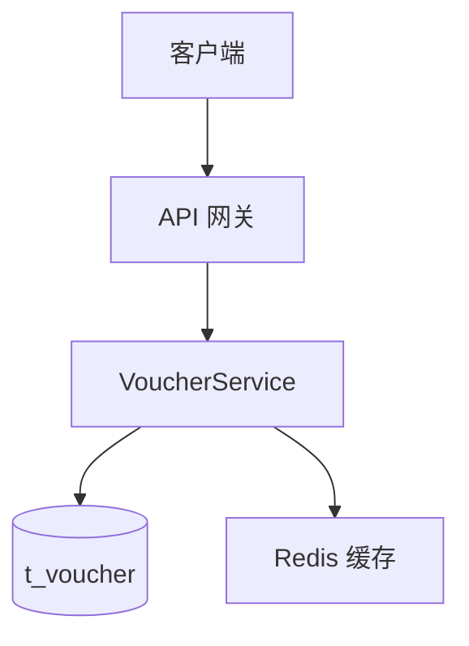
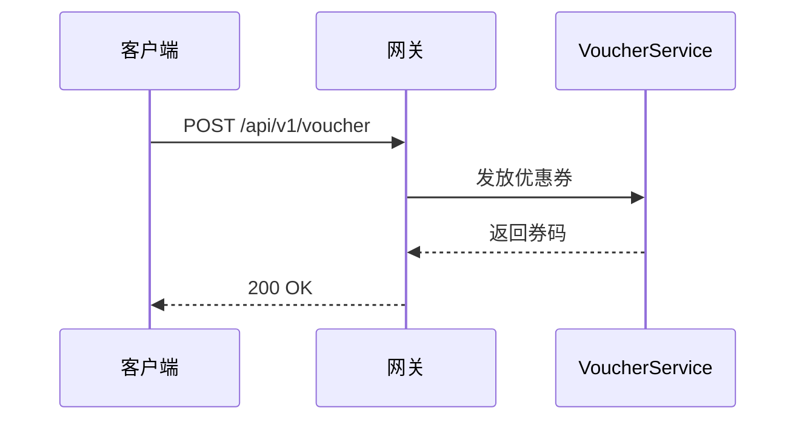
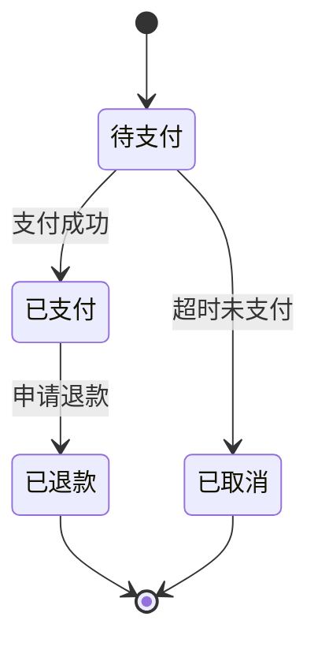
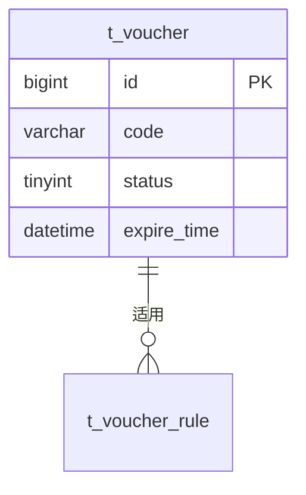

# Mermaid 图表规范 + 自检清单

> 写技术方案的图表章节时加载本文件。
> 所有架构图/流程图/关系图/状态图必须用 mermaid，禁止用 ASCII/text 画图。

## 图表类型选择

| 要表达的内容 | 用什么 | 示例语法 |
|---|---|---|
| 系统架构、模块关系 | `flowchart` 或 `C4Context` | `flowchart TD` |
| 接口调用、时序流程 | `sequenceDiagram` | `sequenceDiagram` |
| 状态流转 | `stateDiagram-v2` | `stateDiagram-v2` |
| 数据模型关系（ER）| `erDiagram` | `erDiagram` |
| 甘特图（里程碑/排期）| `gantt` | `gantt` |

**选型原则**：表达什么就选对应的图类型，不要用 flowchart 画一切。

---

## 最小正确示例

### 架构图（flowchart）



### 时序图（sequenceDiagram）



### 状态机（stateDiagram-v2）



### ER 图（erDiagram）



---

## 自检清单（生成后必查）

写完 mermaid 代码块后，逐项检查：

### 1. 节点标签引号匹配

**错**：`A[xx"x]`（引号不匹配）、`A[xxx"`（缺左引号）

**对**：`A["xx x"]`（含空格用引号包裹）、`A[xxx]`（无特殊字符可省引号）

### 2. subgraph 命名不加多余引号

**错**：
```
subgraph "服务层"
```
（除非标签含特殊字符，否则不加引号）

**对**：
```
subgraph 服务层
```

### 3. 箭头标签的引号

**错**：`A -->|"xxx"| B`（管道符内不必要的引号）

**对**：`A -->|xxx| B`（标签无特殊字符时省引号）

**需要引号的情况**：标签含空格或特殊字符，`A -->|"含 空格"| B`

### 4. 节点文本中的 `~` 符号

**问题**：mermaid 会把 `~` 解析为删除线（HTML `<del>`），导致显示异常。

**错**：`A[金额 ~ 100]`

**对**：用"至"或"—"（破折号）替代
- `A[金额 至 100]`
- `A[金额—100]`

### 5. 特殊字符转义

节点文本含以下字符时要用引号包裹或转义：
- 括号 `()` `[]` `{}`（会和节点形状语法冲突）
- 分号 `;`
- 引号 `"`
- 冒号 `:`（在某些上下文是特殊语法）

**错**：`A[函数 method(x)]`

**对**：`A["函数 method(x)"]`

### 6. 文字方向

中文标签和 mermaid 语法混用时，确认渲染方向（LR/TD）下中文不会断行错乱。建议含长中文标签时用引号包裹。

---

## 强制规则

1. **所有架构图、关系图、流程图、状态图必须用 mermaid**，禁止用 ASCII/text 画图（markdown 表格不算画图）
2. **每张图必须有图注**：图下方写 `> 图 N：<说明>`
3. **图不要太复杂**：单张图节点不超过 15 个。复杂的拆成多张子图或多张独立的图
4. **状态机必须配文字说明**：图 + 文字描述每个流转的触发条件和副作用（呼应 anti-ai-signs.md 第 8 条）

---

## 生成后的最终自检

文档生成完毕、提交终审前，对所有 mermaid 代码块跑一遍：

- [ ] 每个代码块都标注了正确的图类型（flowchart/sequenceDiagram/...）
- [ ] 节点标签引号都匹配
- [ ] subgraph 命名无多余引号
- [ ] 箭头标签无多余引号
- [ ] 没有 `~` 符号（改用"至"或"—"）
- [ ] 含特殊字符的节点文本用了引号
- [ ] 每张图有图注
- [ ] 状态机配了文字说明
